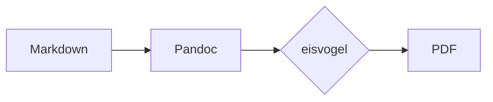
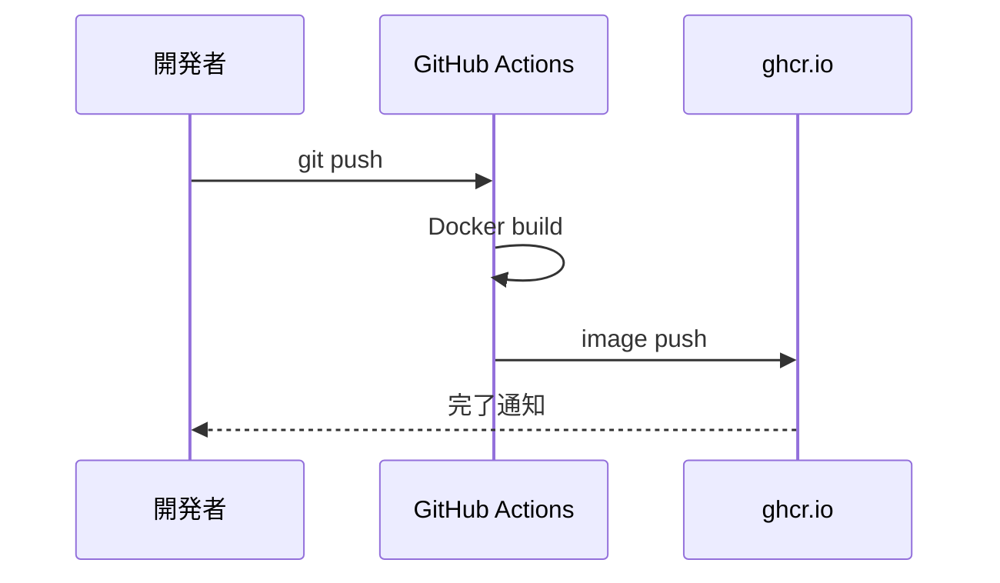

---
title: "サンプルドキュメント"
subtitle: "Techolve Pandoc テンプレート確認用"
author: [Techolve]
date: "2026-05-24"
subject: "Sample"
keywords: [Techolve, Pandoc, PDF]
lang: "ja"
toc: true
toc-own-page: true
titlepage: true
titlepage-color: "000000"
titlepage-text-color: "FFFFFF"
titlepage-rule-color: "FFFFFF"
titlepage-rule-height: 4
titlepage-logo: "../../resources/logo/techolve.png"
logo-width: 40mm
...

# はじめに

これはTecholve用Pandocテンプレートの動作確認サンプルです。

## テキスト

通常のテキスト、**太字**、*イタリック*、`インラインコード`が正しく表示されることを確認します。

リンクの例: [Techolve GitHub](https://github.com/techolve)

## コードブロック

```python
def hello_techolve():
    print("Hello, Techolve!")

if __name__ == "__main__":
    hello_techolve()
```

```bash
# Dockerを使ってPDFを生成する例
docker run --rm \
  -v $(pwd):/workspace \
  ghcr.io/techolve/eisvogel:latest \
  pandoc document.md -d /techolve/techolve-defaults.yaml -o output.pdf
```

## リスト

- 項目A
- 項目B
  - サブ項目B-1
  - サブ項目B-2
- 項目C

1. 手順1
2. 手順2
3. 手順3

## テーブル

| 項目       | 内容                     | 備考   |
|-----------|--------------------------|--------|
| テンプレート | eisvogel ベース          | カスタム |
| ブランドカラー | 黒 (`#000000`)          |        |
| 対応形式   | Markdown → PDF           |        |

## 引用

> Techolveのドキュメントは、シンプルかつ一貫したデザインを目指します。

## 数式

インライン数式: $E = mc^2$

ブロック数式:

$$
f(x) = \int_{-\infty}^{\infty} \hat{f}(\xi) e^{2\pi i \xi x} d\xi
$$

## Mermaid ダイアグラム

フローチャートの例:



シーケンス図の例:



# まとめ

このテンプレートを使用することで、Techolveブランドに統一されたPDFドキュメントを生成できます。
